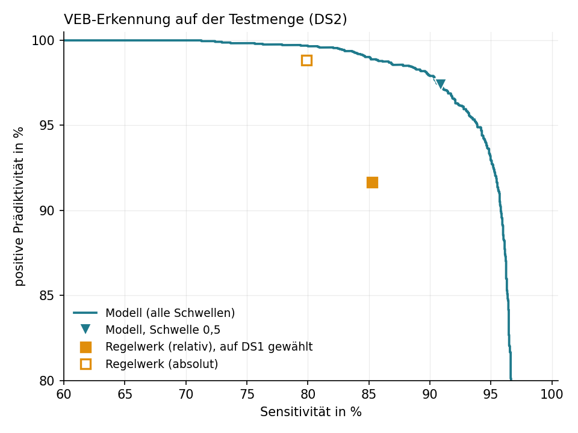
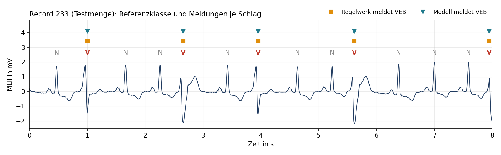
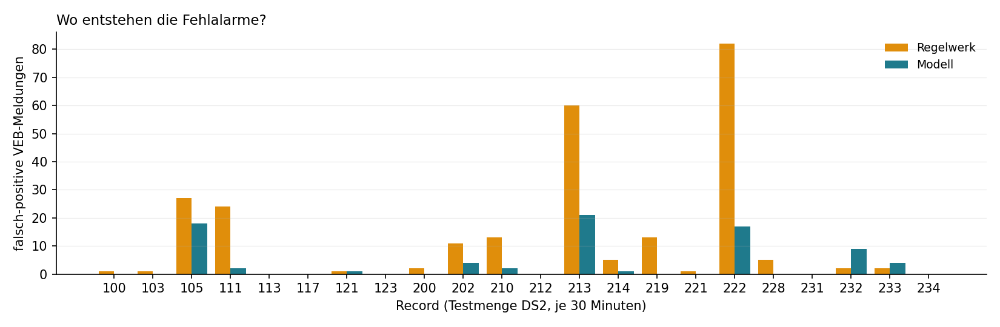
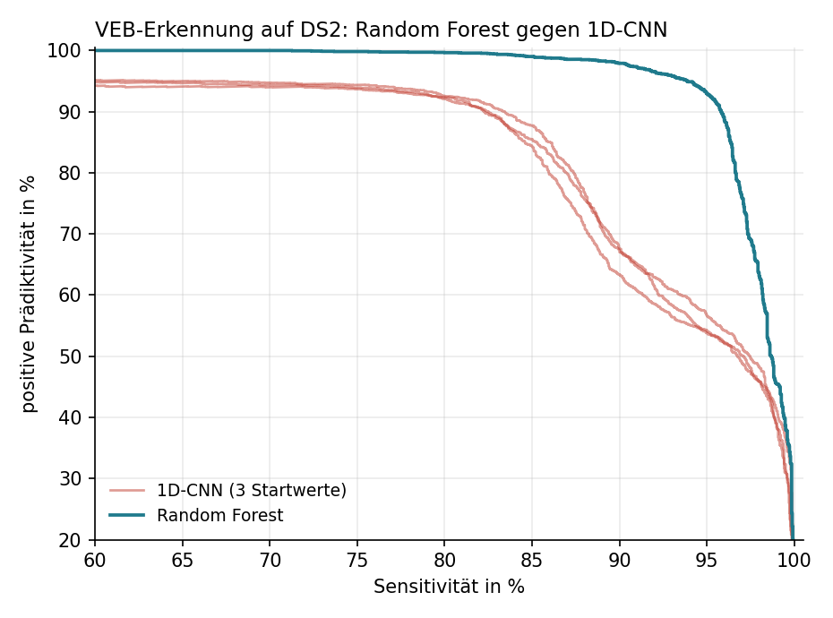

# EKG-Arrhythmie-Erkennung: Baseline auf MIT-BIH


Signalverarbeitungs- und Klassifikationspipeline, die ventrikuläre Extrasystolen (VEB) im EKG erkennt.
Sie vergleicht ein transparentes Regelwerk, ein Modell auf handgemachten Merkmalen (Random Forest) und ein
1D-CNN auf den rohen Schlagfenstern (Deep Learning) und beantwortet eine Frage: Wie viele Fehlalarme lassen
sich vermeiden, ohne echte Ereignisse zu verpassen?

**Stack:** Python, WFDB, SciPy, NeuroKit2, scikit-learn, JAX · **Daten:** MIT-BIH Arrhythmia Database (PhysioNet) · **Status:** Benchmark auf Inter-Patienten-Split, laufendes Projekt

## Ergebnis

Testmenge DS2: 22 Patienten-Records, 11 Stunden EKG, 49.685 Herzschläge, davon 3.220 VEB.
Regelwerk und Modell wurden ausschließlich auf den 22 Records der Trainingsmenge DS1 eingestellt.

| Detektor | Sensitivität | pos. Prädiktivität | Fehlalarme pro Stunde | verpasste VEB |
| --- | --- | --- | --- | --- |
| Regelwerk (vorzeitig und verbreitert) | 85,3 % | 91,7 % | 22,7 | 474 |
| Random Forest auf 34 Merkmalen, Schwelle 0,5 | 90,9 % | 97,4 % | 7,2 | 294 |
| 1D-CNN auf Rohfenstern, Schwelle aus Validierung, Mittel aus 3 Startwerten | 96,6 % | 51,2 % | 269 | 110 |

Das Modell erkennt mehr VEB als das Regelwerk und meldet dabei 68 % weniger Fehlalarme (79 statt 250).
Stellt man es auf dieselbe Sensitivität wie das Regelwerk ein, bleiben 31 Fehlalarme (minus 88 %).
Das CNN findet fast alle VEB, aber jede zweite Meldung ist falsch; schwellenfrei verglichen liegt seine
Average Precision bei 0,874 gegenüber 0,980 beim Random Forest, und bei dessen Sensitivität erreicht es
63,9 % positive Prädiktivität. Warum das so ist, steht unter [Deep Learning](#deep-learning-1d-cnn-gegen-merkmale).



Alle Zahlen erzeugt `run_pipeline.py` in rund einer Minute. Der vollständige Bericht liegt in
[`results/report.md`](results/report.md), die Rohwerte in [`results/metrics.json`](results/metrics.json).

## Motivation: Alarm Fatigue

Patientenmonitore auf Intensivstationen erzeugen sehr viele Alarme, von denen die meisten falsch sind.
Drew et al. (2014) zählten in fünf Intensivstationen innerhalb von 31 Tagen rund 2,56 Millionen Alarme bei
461 Patienten. Von 12.671 nachträglich geprüften Arrhythmie-Alarmen waren 88,8 % falsch-positiv. Als eine
Ursache nennt die Studie breite QRS-Komplexe durch Schenkelblock. Wer ständig falsche Alarme hört,
reagiert langsamer auf die echten.

Zwei öffentliche Benchmarks adressieren genau dieses Problem auf Alarmebene:

- **PhysioNet/CinC Challenge 2015:** 1.250 Arrhythmie-Alarme von Intensivmonitoren (750 Training, 500 Test).
  Die Bewertung bestraft einen unterdrückten echten Alarm fünfmal so stark wie einen durchgelassenen falschen.
  Der beste Echtzeit-Beitrag erreichte 81,39 Punkte.
- **VTaC (NeurIPS 2023):** 5.037 von Experten annotierte Alarme für ventrikuläre Tachykardie, davon nur
  28,6 % echt. Die Autoren vergleichen klassisches maschinelles Lernen, Deep Learning, kontrastives Lernen
  und generative Ansätze.

Dieses Repository setzt eine Ebene darunter an: beim einzelnen Herzschlag. Eine ventrikuläre Tachykardie
besteht aus aufeinanderfolgenden ventrikulären Schlägen. Ein Detektor, der diese Schläge mit wenigen
Fehlmeldungen erkennt, ist deshalb der Baustein für jede Alarmlogik darüber.

## Pipeline



1. **Laden** (`ecg/data.py`): Signal und Kardiologen-Annotationen über WFDB, Ableitung MLII.
2. **Vorverarbeiten** (`ecg/features.py`): Butterworth-Bandpass 0,5 bis 40 Hz ohne Phasenverschiebung.
   Er entfernt Grundlinienschwankung und hochfrequentes Rauschen.
3. **Merkmale je Schlag** (`ecg/features.py`), 34 Stück in drei Gruppen:
   - Rhythmus: RR-Intervalle davor und danach, jeweils auch relativ zum lokalen Rhythmus
   - QRS-Komplex: Halbwertsbreite des größten Ausschlags, absolut und relativ zu den letzten 30 Schlägen,
     dazu die relative Amplitude
   - Morphologie: Schlagform von 250 ms vor bis 400 ms nach der R-Zacke als 26 Mittelwerte über je 25 ms
4. **Regelwerk** (`ecg/detectors.py`): VEB, wenn der Schlag vorzeitig einfällt und verbreitert ist, oder wenn er
   stark verbreitert ist. Die drei Schwellen stammen aus einer Gittersuche auf DS1.
5. **Modell** (`ecg/detectors.py`): Random Forest mit 200 Bäumen auf allen Merkmalen, Klassen gewichtet,
   Hyperparameter ohne Tuning festgelegt.
6. **Auswerten** (`ecg/evaluate.py`): Sensitivität, positive Prädiktivität und Fehlalarme pro Stunde auf DS2.
7. **R-Zacken-Detektion prüfen** (`ecg/qrs.py`): NeuroKit2-Detektor gegen die Referenz, Toleranz 150 ms.

## Methodik

**Daten.** Die MIT-BIH Arrhythmia Database enthält 48 halbstündige Zweikanal-Aufnahmen von 47 Personen,
abgetastet mit 360 Hz. Jeder Schlag wurde von mindestens zwei Kardiologen annotiert.

**Aufteilung nach Patienten.** Training und Test folgen der Aufteilung von de Chazal et al. (2004):
DS1 und DS2 mit je 22 Records. Kein Record liegt in beiden Mengen. Das ist entscheidend, denn bei einer
zufälligen Aufteilung der Schläge lernt ein Modell die Patienten auswendig und die Zahlen fallen zu gut aus.
Die vier Records mit Schrittmacherschlägen bleiben nach AAMI-Empfehlung außen vor.

**Klassen.** Die MIT-BIH-Symbole werden auf die AAMI-Klassen N, S, V, F und Q abgebildet (ANSI/AAMI EC57).
Zielgröße ist die Klasse V. Die Klasse Q kommt nur 15-mal vor und wird nicht ausgewertet.

**Kennzahlen.** Bei 6,5 % VEB-Anteil wäre die Trefferquote über alle Schläge irreführend. Berichtet werden
deshalb Sensitivität und positive Prädiktivität sowie Fehlalarme pro Stunde als anschauliche Größe.

## Befunde im Detail

**Fehlalarme des Regelwerks entstehen bei wenigen Patienten.** Vier der 22 Test-Records verursachen 77 %
seiner Fehlalarme, jeweils aus einem nachvollziehbaren Grund:

| Record | Fehlalarme Regelwerk | Fehlalarme Modell | fälschlich gemeldete Schläge |
| --- | --- | --- | --- |
| 222 | 82 | 17 | vorzeitige Vorhofschläge (45) und normale Schläge (37) |
| 213 | 60 | 21 | fast nur Fusionsschläge (58): Mischform aus normalem und ventrikulärem Schlag |
| 105 | 27 | 18 | normale Schläge |
| 111 | 24 | 2 | Schläge mit Linksschenkelblock: verbreitert, aber nicht ventrikulär |



Record 111 zeigt im Kleinen, was Drew et al. auf der Intensivstation beobachtet haben: Ein breiter
QRS-Komplex allein ist kein verlässliches Kriterium.

**Der Abstand hängt vom Regelwerk ab.** Eine zweite Regelvariante misst die QRS-Breite absolut in
Millisekunden statt relativ zum Patienten. Auf DS1 ist sie schwächer (F1 0,786 gegenüber 0,817) und wurde
deshalb nicht als Hauptvariante gewählt. Auf DS2 erreicht sie dagegen 98,8 % positive Prädiktivität bei
79,9 % Sensitivität und nur 30 Fehlalarmen. Das Modell liegt bei gleicher Sensitivität auch hier vorn
(8 Fehlalarme), der Abstand ist in absoluten Zahlen aber klein. Feste Schwellen reagieren also empfindlich
auf die Patientenauswahl, und 22 Testpatienten sind eine schmale Basis.

**Das Modell stützt sich auf dieselben Größen wie die Regel.** Die wichtigsten Merkmale sind Vorzeitigkeit,
die Pause nach dem Schlag und die relative QRS-Breite. Der Gewinn kommt daraus, dass das Modell sie
gemeinsam mit der Schlagform gewichtet, statt drei feste Schwellen zu verknüpfen.

**Verpasste VEB sind ebenfalls konzentriert.** 96 % der vom Modell verpassten VEB liegen in sechs Records
(233, 214, 200, 210, 213, 105).

**R-Zacken-Detektion.** Über alle 44 Records findet der NeuroKit2-Detektor 98,8 % der Schläge bei 98,1 %
positiver Prädiktivität. Die Schwächen sind wieder patientenspezifisch: In Record 113 gibt es 1.039
Fehldetektionen (positive Prädiktivität 63,3 %), in Record 207 werden 28 % der Schläge verpasst.

## Deep Learning: 1D-CNN gegen Merkmale



`ecg/cnn.py` trainiert ein kleines Faltungsnetz (7.089 Parameter, JAX, nur CPU) direkt auf den
Schlagfenstern: Kanal 1 ist der bandpassgefilterte Schlag von 250 ms vor bis 400 ms nach der R-Zacke, Kanal 2
die Abweichung dieses Schlags vom Median der 30 vorangegangenen Schläge desselben Patienten, dazu die zwei
Rhythmusmerkmale. Training nur auf DS1 mit Klassengewichtung, Epochenwahl und Entscheidungsschwelle auf fünf
abgetrennten DS1-Patienten (nie auf DS2), drei Startwerte, zwei Minuten je Training.

Das Ergebnis ist eindeutig und lehrreich: Das CNN ist dem Random Forest unterlegen, nicht knapp, sondern bei
jeder Schwelle (Abbildung). Zwei Patienten der Testmenge erklären den Großteil seiner Fehlalarme: Record 117
(1.127 falsch gemeldete normale Schläge, der Patient hat keine einzige VEB) und Record 111 (748 Schläge mit
Linksschenkelblock). Beide haben eine Normalmorphologie, die dem Netz aus dem Training als „ventrikulär"
vorkommt. Der Random Forest meldet in diesen beiden Records zusammen 2 Fehlalarme, weil seine Merkmale relativ
zum Patienten sind: QRS-Breite im Verhältnis zu den letzten 30 Schlägen, Amplitude relativ zur eigenen
Referenz. Der Vorlagenkanal des CNN gibt ihm dieselbe Information, hebt die Präzision von 40 auf 51 %, mehr
nicht. Was der Random Forest zusätzlich kann: Die Schwelle 0,5 bedeutet bei ihm für jeden Patienten
dasselbe, beim CNN wandert die Score-Verteilung von Patient zu Patient, sodass die auf DS1 gewählte Schwelle
auf DS2 nicht passt.

Das ist der Befund, der in der Literatur zum Inter-Patienten-Split immer wieder auftaucht: Ohne
patientenrelative Normierung generalisiert Deep Learning auf 22 Trainingspatienten schlechter als
Feature-Engineering mit Domänenwissen. Ein größeres Netz, mehr Epochen oder Augmentierung würden den
Trainingsverlust senken, aber nicht das Problem lösen, dass die Testpatienten anders aussehen als die
Trainingspatienten. Die Trainingskurven in [`results/figures/cnn_training.png`](results/figures/cnn_training.png)
zeigen genau das: Der Validierungsverlust steigt ab Epoche 4 bis 6, während der Trainingsverlust weiter fällt.

**Einordnung.** De Chazal et al. (2004) berichten auf derselben Aufteilung für VEB eine Sensitivität von
77,7 % bei 81,9 % positiver Prädiktivität. Der Vergleich ist nur grob: Dort wurde ein Fünf-Klassen-Problem
mit linearer Diskriminanzanalyse gelöst, hier eine Ja/Nein-Frage.

## Reproduzieren

Voraussetzung: Python 3.11 oder neuer. Der erste Lauf lädt rund 90 MB von PhysioNet.

Windows (PowerShell):

```powershell
git clone https://github.com/jonathankuhn11-spec/ecg-arrhythmia-detection.git
cd ecg-arrhythmia-detection
python -m venv .venv
.venv\Scripts\Activate.ps1
python -m pip install -r requirements.txt
python run_pipeline.py --download
```

macOS und Linux: statt der vierten Zeile `source .venv/bin/activate`.

Weitere Läufe starten mit `python run_pipeline.py`. Zufallsstartwert und Paketversionen sind fixiert.
Auf anderen Betriebssystemen können einzelne Zähler durch Rundungsunterschiede um wenige Schläge abweichen.

Deep-Learning-Vergleich (nach dem ersten Lauf, rund 8 Minuten auf einer CPU):

```powershell
python run_cnn.py
```

Tests laufen ohne Download auf synthetischen Signalen:

```powershell
python -m pytest -q
```

Falls der Download scheitert: das ZIP von der
[PhysioNet-Seite der Datenbank](https://physionet.org/content/mitdb/1.0.0/) laden und die Dateien nach
`data/mitdb/` entpacken.

## Projektstruktur

```
ecg/
  config.py      Konstanten: Aufteilung, AAMI-Klassen, Filter- und Fensterparameter
  data.py        Download und Laden über WFDB
  features.py    Bandpass, RR-Intervalle, QRS-Breite, Morphologie
  detectors.py   Regelwerk mit Kalibrierung, Random Forest
  evaluate.py    Kennzahlen, Abgleich detektierter R-Zacken, Schwellenwahl auf Validierung
  qrs.py         R-Zacken-Detektion mit NeuroKit2
  cnn.py         1D-CNN in JAX: Schlagfenster mit Vorlagenkanal, Training, Vorhersage
  report.py      Abbildungen und Markdown-Bericht
run_pipeline.py  kompletter Lauf von den Rohdaten bis zum Bericht
run_cnn.py       Deep-Learning-Vergleich: Training, schwellenfreie Metriken, Score-Export
tests/           25 Tests auf synthetischen Signalen
results/         Kennzahlen, Bericht und Abbildungen des letzten Laufs; cnn.json und cnn_scores.npz
```

## Grenzen

- **Schlagebene statt Alarmebene.** MIT-BIH enthält ambulante Langzeit-EKGs, keine Monitoralarme.
  Ob weniger Fehlmeldungen je Schlag zu weniger Fehlalarmen am Bett führen, zeigt erst ein Datensatz wie VTaC.
- **Referenzpositionen.** Die Klassifikation nutzt die annotierten Schlagpositionen, wie in der Literatur
  üblich. Die Detektion wird getrennt geprüft. Fehler der Detektion fließen noch nicht in die VEB-Zahlen ein.
- **Schmale Testbasis.** 22 Records, eine Aufteilung, keine Konfidenzintervalle. Die Fehler konzentrieren sich
  auf wenige Patienten.
- **Ein Patient in beiden Mengen.** Die Records 201 (DS1) und 202 (DS2) stammen von derselben Person.
  Das ist eine bekannte Eigenschaft der Standardaufteilung.
- **Vergleich bei gleicher Sensitivität.** Die Modellschwelle dafür wurde auf DS2 abgelesen. Sie beschreibt
  die Trennschärfe und ist kein vorab festgelegter Betriebspunkt. Die CNN-Schwelle dagegen stammt aus der
  Validierung auf DS1; auf DS2 abgelesen wäre sie schöner, aber nicht ehrlich.
- **Kleines Netz, kurzes Training.** Das CNN ist bewusst klein, damit es auf einer CPU in zwei Minuten
  trainiert. Es belegt den Inter-Patienten-Effekt, nicht die Obergrenze dessen, was Deep Learning kann.
- **Nicht in Echtzeit.** Die Normierung der Schlagform nutzt die mittlere Amplitude des ganzen Records,
  und jeder Schlag wartet auf seinen Nachfolger.
- **Eine Ableitung.** Verwendet wird nur MLII.
- **Kein Medizinprodukt.** Lern- und Forschungsprojekt, nicht für klinische Entscheidungen geeignet.

## Nächste Schritte

1. End-to-End-Lauf mit detektierten statt annotierten R-Zacken
2. CNN mit patientenweiser Normierung der Scores (z. B. Schwelle je Patient aus dessen ersten Minuten) und
   Vergleich mit einem Hybrid: CNN-Einbettung plus relative Merkmale im Random Forest
3. Konfidenzintervalle über Records (Bootstrap) und patientenweise Kreuzvalidierung auf DS1
4. Übertrag auf die Alarmebene mit CinC 2015 und VTaC
5. Eigene Aufnahmen mit einem AD8232-Sensoraufbau durch dieselbe Vorverarbeitung und Detektion schicken

## Quellen

- Moody GB, Mark RG. The impact of the MIT-BIH Arrhythmia Database. IEEE Engineering in Medicine and Biology
  Magazine 20(3):45-50, 2001. Daten: <https://physionet.org/content/mitdb/1.0.0/>
- Goldberger AL et al. PhysioBank, PhysioToolkit, and PhysioNet. Circulation 101(23):e215-e220, 2000.
- de Chazal P, O'Dwyer M, Reilly RB. Automatic classification of heartbeats using ECG morphology and heartbeat
  interval features. IEEE Transactions on Biomedical Engineering 51(7):1196-1206, 2004.
  <https://doi.org/10.1109/TBME.2004.827359>
- Drew BJ et al. Insights into the problem of alarm fatigue with physiologic monitor devices.
  PLoS ONE 9(10):e110274, 2014. <https://pmc.ncbi.nlm.nih.gov/articles/PMC4206416>
- Clifford GD et al. The PhysioNet/Computing in Cardiology Challenge 2015: Reducing false arrhythmia alarms
  in the ICU. Computing in Cardiology 2015. <https://physionet.org/content/challenge-2015/1.0.0/>
- Lehman LH et al. VTaC: A benchmark dataset of ventricular tachycardia alarms from ICU monitors.
  NeurIPS 2023, Datasets and Benchmarks Track. <https://physionet.org/content/vtac/1.1/>
- Makowski D et al. NeuroKit2: A Python toolbox for neurophysiological signal processing.
  Behavior Research Methods 53:1689-1696, 2021. <https://doi.org/10.3758/s13428-020-01516-y>
- ANSI/AAMI EC57: Testing and reporting performance results of cardiac rhythm and ST segment measurement
  algorithms.

## Lizenz

Code unter MIT-Lizenz, siehe [LICENSE](LICENSE). Die EKG-Daten liegen nicht im Repository. Sie werden beim
ersten Lauf von PhysioNet geladen und unterliegen der dort angegebenen Lizenz.
